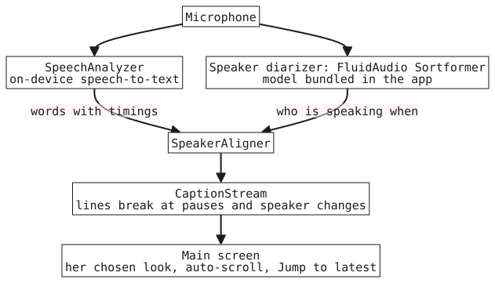

<p align="center"></p>

# Clarity Captions

Live captions of the conversation around you, on an iPhone, with no network once the system speech
model is installed. Built for a deaf mother who should not need a service connection to follow
dinner. The App Store name will be **Seal** ([ADR 0011](docs/adr/0011-working-name-vs-store-name.md)).

**Status: working spike, not released.** Runs on an iPhone 17 Pro; target is the intended user's
iPhone 17 by **2026-10-25**; TestFlight first ([ADR 0009](docs/adr/0009-testflight-then-app-store-distribution.md)).
It is free and non-commercial by design ([ADR 0007](docs/adr/0007-free-and-non-commercial-by-design.md)).

## How it works



- **Words:** Apple's `SpeechAnalyzer` (iOS 26), on device.
- **Speaker changes:** FluidAudio's Sortformer diarizer (it tells voices apart by sound; it doesn't identify anyone), with its model bundled in the app
  ([ADR 0014](docs/adr/0014-bundle-diarizer-models-in-the-app.md)), so there is no download path.
- **Captions:** words are paired with speakers and broken at pauses and speaker changes, one colour
  per speaker, auto-scrolling with a *Jump to latest* control. The look is the user's to change.

Why it labels speakers instead of hiding the user's own voice:
[ADR 0008](docs/adr/0008-speaker-turn-labeling-replaces-own-voice-filtering.md).

## What is and is not verified

| Claim | State |
|---|---|
| Runs on a real iPhone 17 Pro | yes |
| Two synthetic voices separated, model loaded from disk, offline mode on | yes ([ADR 0014](docs/adr/0014-bundle-diarizer-models-in-the-app.md#measured-2026-10-02)) |
| First launch with networking off, on a real phone | not yet |
| Accuracy in a noisy room | **not yet measured** |
| More than four speakers | not supported (diarizer limit) |

"Offline" means zero network *after* iOS has installed its speech-model asset, which may need a
one-time fetch before first use.

## Getting started: build the spike

Needs Xcode 26, [XcodeGen](https://github.com/yonaskolb/XcodeGen), an Apple developer team and a phone.

```sh
scripts/fetch-diarizer-models.sh        # once: downloads the 241 MB model, verifies size and sha256
echo YOUR_TEAM_ID > Apps/Spike/.team   # or export DEVELOPMENT_TEAM; the file is gitignored
scripts/generate-spike-project.sh       # writes Apps/Spike/CaptionSpike.xcodeproj
```

Open the generated project and run on a device. The model is not committed; generation fails
loudly if it is missing, so a model-less build cannot happen quietly.

## Where things are

| Path | What |
|---|---|
| `Packages/CaptionCore` | the shared engine: transcription, diarization, alignment, caption stream, style |
| `Apps/Spike` | the iPhone app (display name Seal) |
| [`CONTEXT.md`](CONTEXT.md) | domain terms |
| [`docs/adr/`](docs/adr) | the 14 decisions and why |
| [`docs/use-cases.md`](docs/use-cases.md) | who it is for and when |
| [`docs/testing/human-testing-guide.md`](docs/testing/human-testing-guide.md) | for people trying it |
| [`docs/app-store-compliance.md`](docs/app-store-compliance.md) | store requirements |
| [`docs/research-existing-resources.md`](docs/research-existing-resources.md) | prior art |

## Contributing

Issues and decisions are on GitHub Issues; read `CONTEXT.md` and the ADRs first.

## License

No license file yet. Until one is added, all rights are reserved by default.
