# UI audit, 2026-10-10: everything Seal can show, and whether it was approved

**Why:** after testing v1 on his iPhone, the owner found screens he never approved and never saw in a PR (the seal
in a box after Start, a boxed "Seal tells voices apart" banner, an extra pop-up after [ Save ]). This audit lists
**every** screen, overlay, alert, sheet, banner, hint and transition the app can show, from the code
(`Apps/Spike/Sources`, the CaptionCore types that drive the UI) and from real simulator screenshots of `main` at
8454234 (iPhone 17 Pro, debug build; DEBUG-only demo flags reach each state, see `DemoMode.swift`).

**Approved** means it appears in an approved mock-up or in the images of a PR the owner approved, cited. Everything
else is **not approved** and gets its own question in the round-2 PR's Decisions. Approved items that break the
round-2 rules below (one screen, fades only, no boxes or borders) are also flagged.

Round-2 mock-ups: [`docs/design/mocks/round2/`](mocks/round2/). Rules: [`v1-polish-spec.md` § Round 2](v1-polish-spec.md#round-2-2026-10-10-one-screen-fades-only).

## The extra pop-up after [ Save ] (reported by the owner)

Reproduced. It is the **how-to-use tour**, not a save prompt. While the tour is on step 4 ("Tap [ Save ] to keep
it"), tapping [ Save ] calls `tour.did(.tappedSave)` (`ContentView.swift`, `CaptionModel.save()`), which advances
the tour immediately: within a fraction of a second the veil and [ Save ] / [ New ] are dimmed again and step 5's
bordered card ("Hold on words to copy them", with a spotlight frame on a caption) pops up, so the
[ ✔ ] → [ Saved ] moment is covered. Outside the tour, saving shows only [ ✔ ] → [ Saved ] (checked in a beta-mode
build: no rating card or prompt on Save; the beta rating card only follows [ New ]).

| Before [ Save ] | ~1 s after [ Save ] | Recording |
|---|---|---|
| 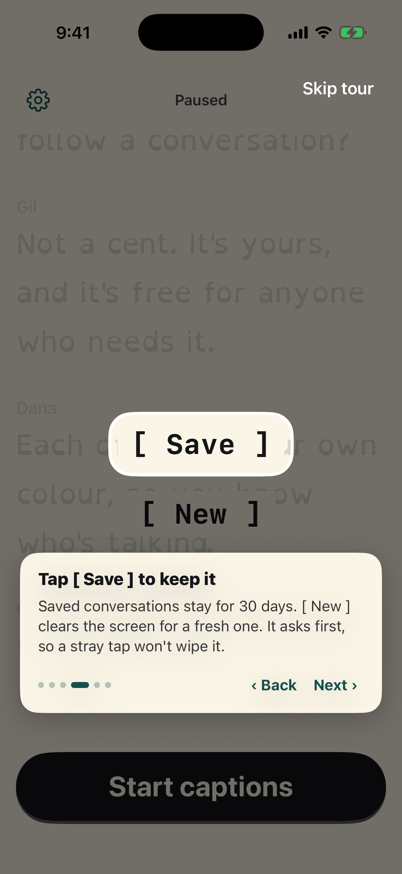 | 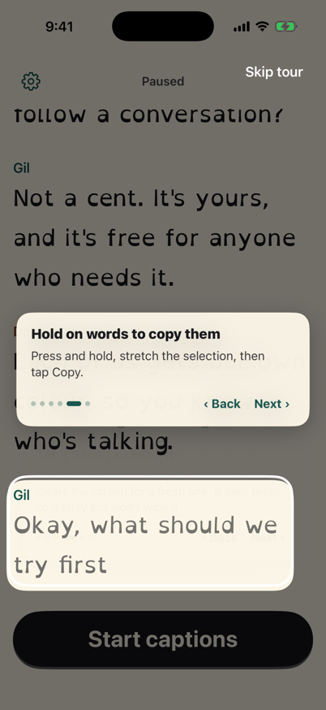 | 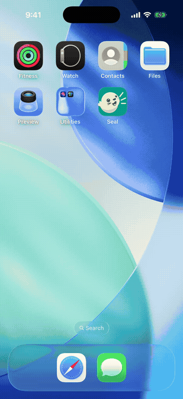 |

Decision `savepopup` (round-2 PR). The proposal (tour v2) lets [ Saved ] finish, then fades the next words in,
with no card: [`anim-tour-save-moment.gif`](mocks/round2/anim-tour-save-moment.gif).

## Every element

Columns: what it is · screenshot · how it appears / goes away · approved? (source) · decision id in the round-2 PR.

### Launch and first run

| # | Element | Screenshot | Appears / goes | Approved? | Decision |
|---|---|---|---|---|---|
| 1 | Launch dance on green, iris-in, jump, splash, ripples | 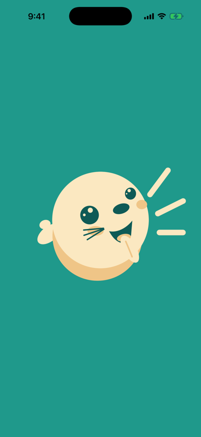 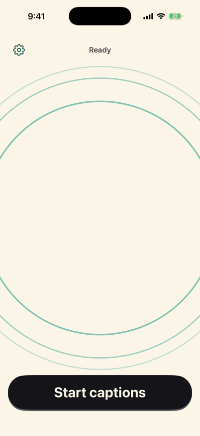 | iOS launch screen → dance → hand-off. The hand-off cuts from full green straight to a circle (see strip below) | **Yes**, #99 frames v3, PR #110. Owner: "could be more fluid and less blocky" | `handoff` |
| 2 | Launch progress bar (only when setup outlasts the dance) | 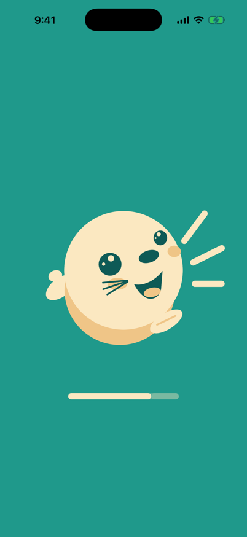 | Fades in under the seal | **Yes**, PR #110 | — |
| 3 | Welcome ("Hi! Let's get you set up.", blue "Let's go") | 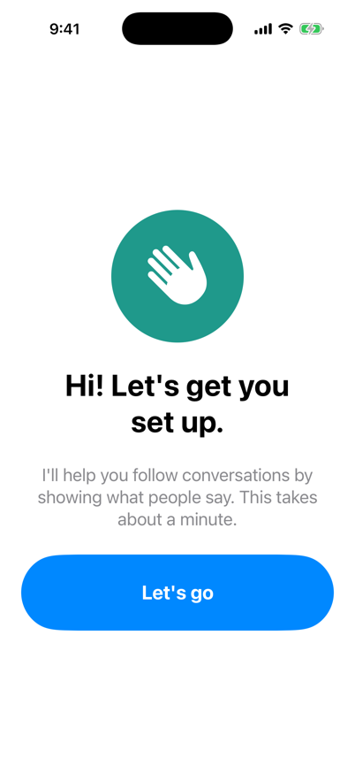 | Hard switch after the launch | First-run design #11 (before v1). **Not in the v1 look** (white screen, system-blue button) | `firstrunlook` |
| 4 | Microphone permission | (Apple's system prompt) | System alert | iOS controls it; can't be restyled | — |
| 5 | Microphone off ("I can't hear yet", blue "Open Settings") | 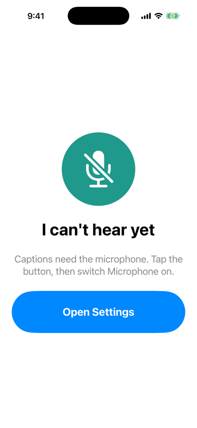 | Hard switch | #11 (before v1). **Not in the v1 look** | `firstrunlook` |
| 6 | Unsupported device ("This device can't show captions") | 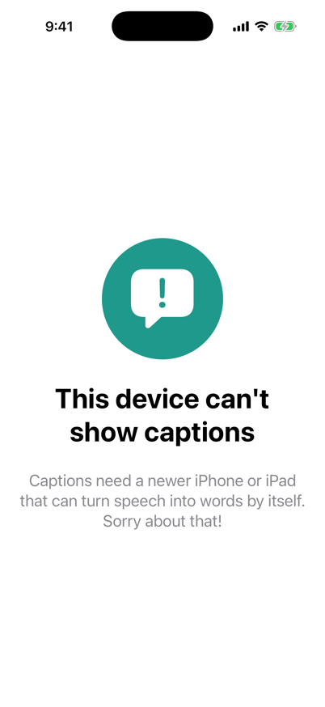 | Hard switch | PR #85 (before v1). **Not in the v1 look** | `firstrunlook` |
| 7 | Download failed ("Learning English", red text, blue "Try again") | 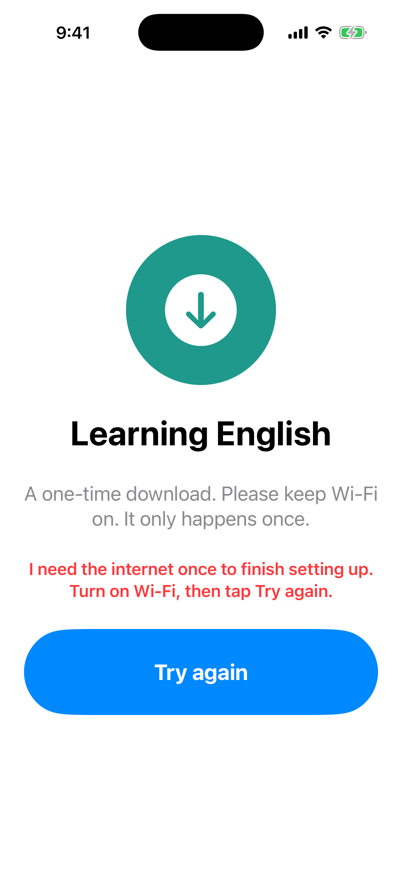 | Hard switch | PR #88 (before v1). **Not in the v1 look** | `firstrunlook` |
| 8 | One-time beta notice ("Thanks for testing Seal") | 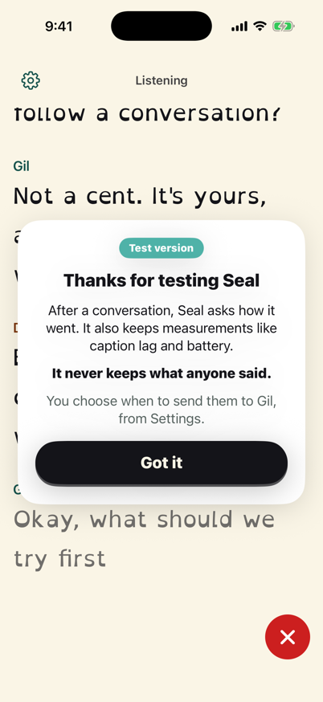 | Bordered card, fade + scale | **Yes**, mock beta-feedback/06, PR #115. Boxed: breaks the round-2 rules | `cards` |
| 9 | The tour starts by itself after the launch |  | Dim + bordered card, fade + scale | **Yes**, PR #114 | `tour` |

Hand-off today (5 fps): 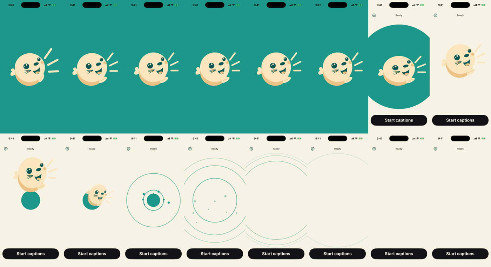

### Main screen

| # | Element | Screenshot | Appears / goes | Approved? | Decision |
|---|---|---|---|---|---|
| 10 | Status row: gear + Ready / Listening / Paused | 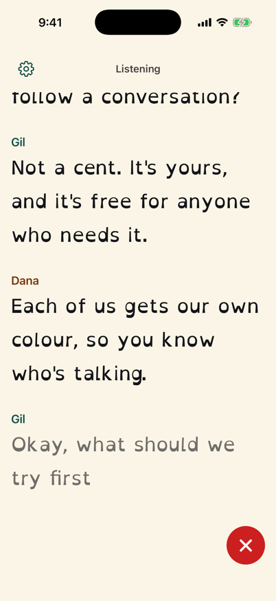 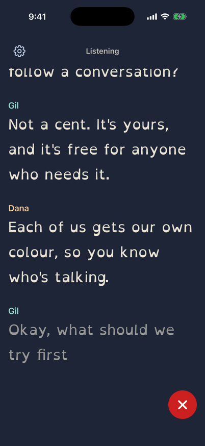 | Text changes in place | **Yes**, mock 01, PR #106, #113 | — |
| 11 | Status detail line ("No one is talking right now", "The microphone stopped…", "No one talked for 5 minutes") | 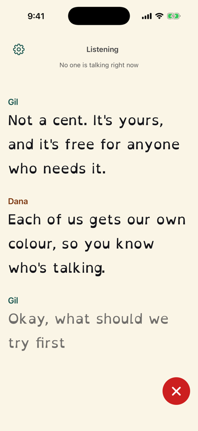 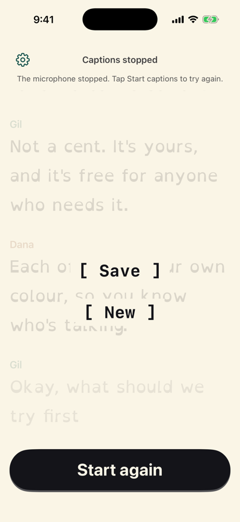 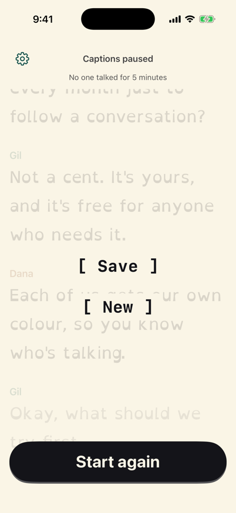 | Text under the status | **Yes**, states #9 (ADR 0018), PR #92 | — |
| 12 | Captions, speaker labels, unfinished words faded |  | Live | **Yes**, mock 01, PR #105 | — |
| 13 | Top caption line cut in half under the status row |  | Hard edge while scrolling | Not in any mock (flagged on PR #113) | `topedge` |
| 14 | Stop: red ✕ circle, bottom right |  | Start pill morphs into it | **Yes**, #96 answer "bottom right as today" | — |
| 15 | Start captions pill (gummy) / "Start again" after a stop | 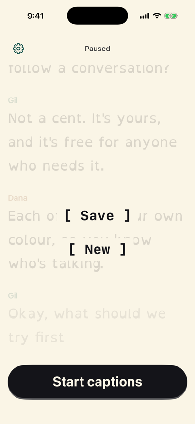  | Morph | **Yes**, PR #113, #92 | — |
| 16 | **"Getting ready" cover with the seal in a square box** | 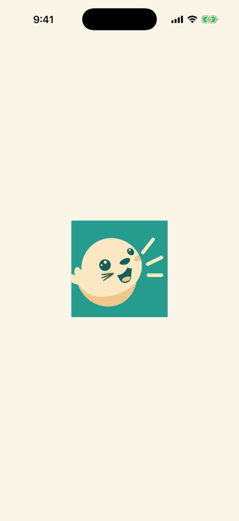 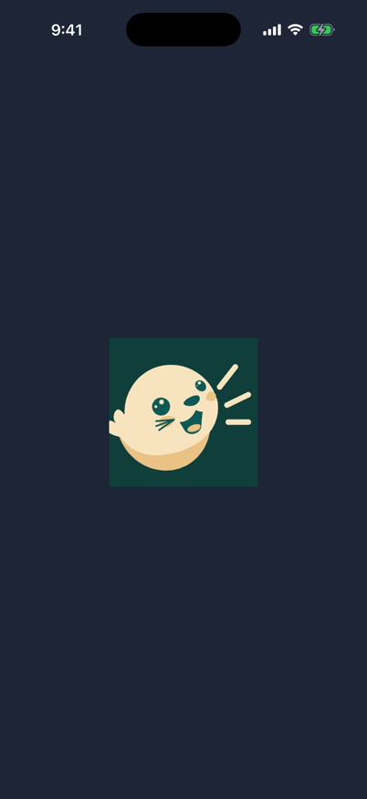 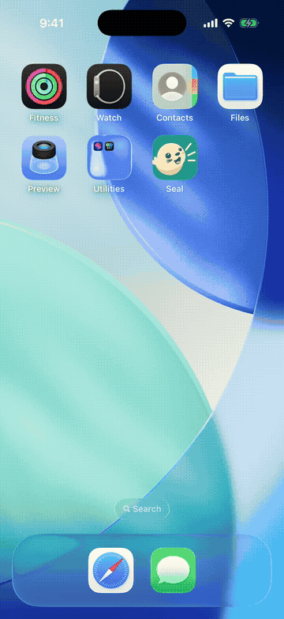 | Full-screen cover, fade, after Start if getting ready is slow (`showPreparingAnimation`, old `LaunchAnimationView`) | **Not approved**: left over from #23, never in a v1 mock or PR | `preparing` |
| 17 | **"Seal tells voices apart as people talk." banner with Got it** | 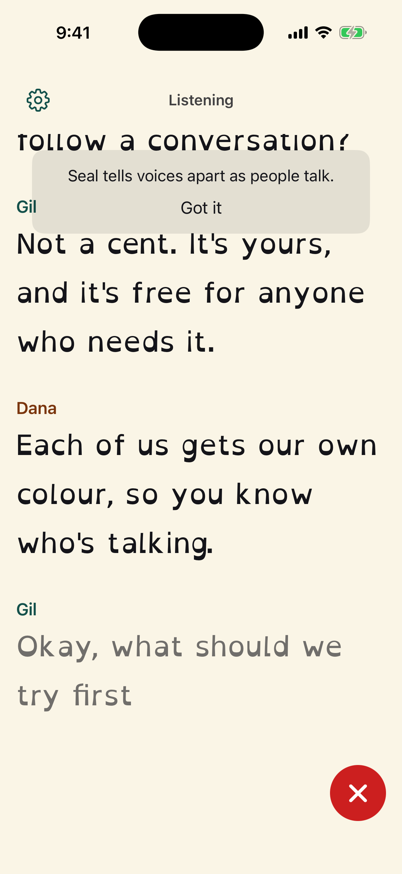 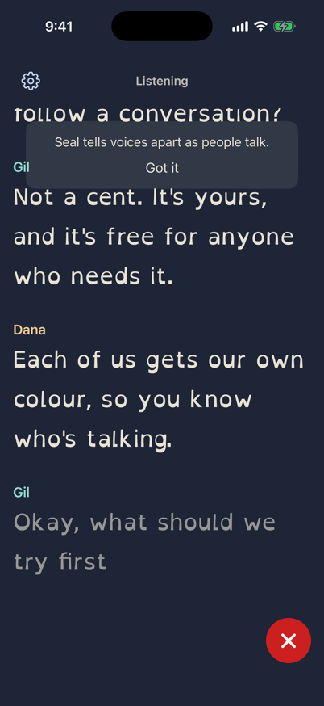 | Slides down from the top + fade; stays until "Got it", over the captions | **Not approved** (#55, before v1; never in a v1 mock or PR) | `voices` |
| 18 | "Jump to latest" button (filled capsule) | (state not reachable on the simulator: it appears only after scrolling back by hand) | Appears at the bottom when scrolled up | #17 (before v1). **Not in the v1 look** (system bordered button) | `jumplatest` |
| 19 | Pause veil with [ Save ] / [ New ] |  | Fade | **Yes**, mock 02, PR #106 | — |
| 20 | [ ✔ ] → [ Saved ] (green) | 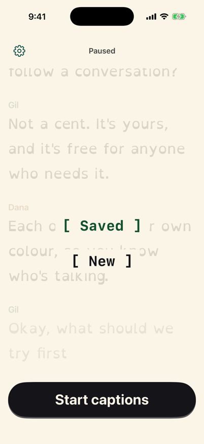  | Cross-fade in place | **Yes**, mock 03, PR #106 | — |
| 21 | Hint pill "Hold on empty space to bring back Save and New" | 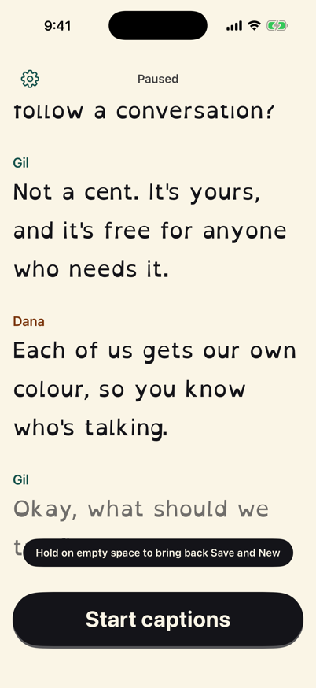 | Fade, first 3 times | **Yes**, mock 04 | — |
| 22 | **"Start a new conversation?" alert** | 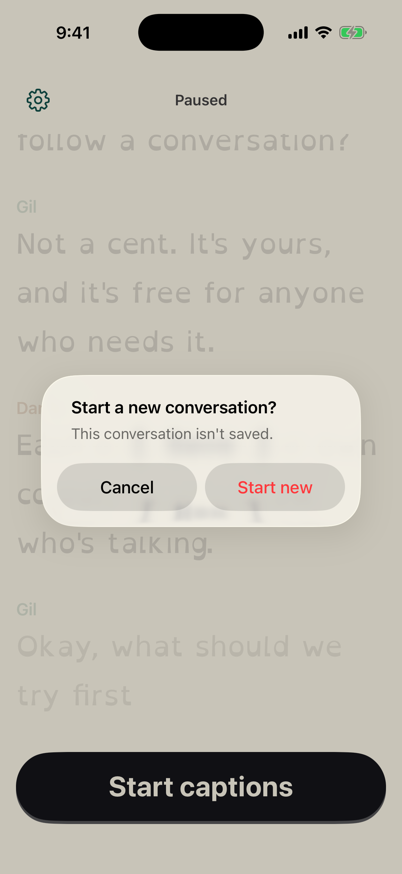 | iOS alert box | **Not approved** as a box (#106 approved one confirmation, never its look) | `confirmnew` |
| 23 | **"Name this speaker" alert with a text field** | 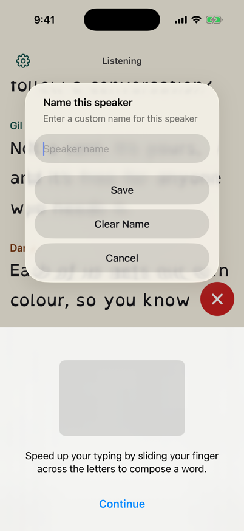 | iOS alert box + keyboard | **Not approved** (#56, before v1) | `namespeaker` |
| 24 | Selection with handles + Copy button | 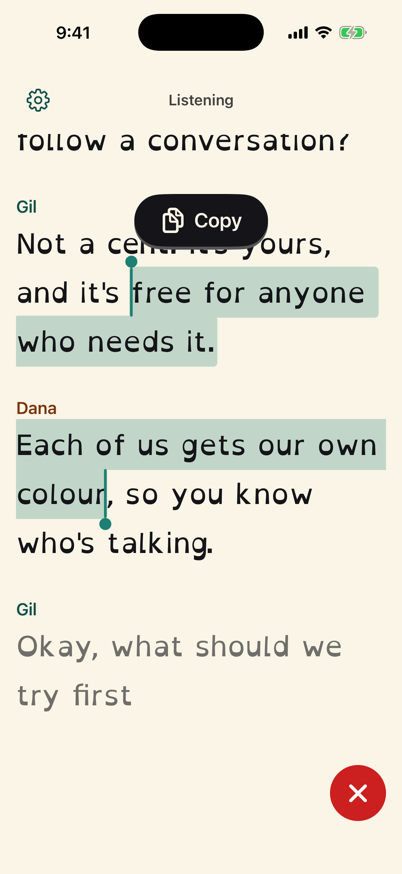 | Copy fades in after 0.5 s | **Yes**, mock 05, PR #109 | — |
| 25 | **Extra pop-up after [ Save ] (the tour moving on)** | 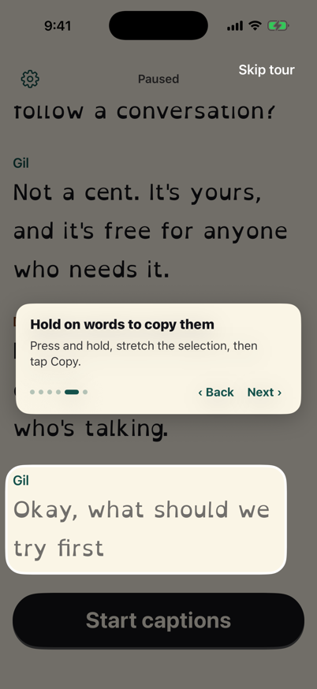 | Next tour card scales in right after Save | **Not approved** behaviour | `savepopup` |
| 26 | Rating card after [ New ] (beta only) |  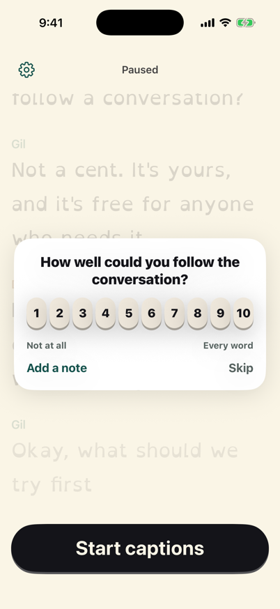 | Bordered card, fade + scale | **Yes**, mock beta-feedback/01, PR #115. Boxed: breaks the round-2 rules | `cards` |
| 27 | Landscape | 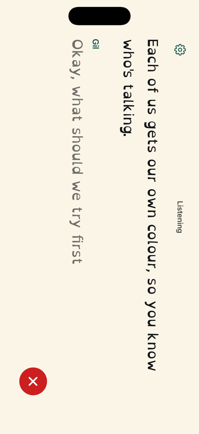 | Rotation | **Yes**, PR #106 | — |
| 28 | Developer panel (hold the status text 1.5 s) | (not shown: a hidden tool) | Appears at the bottom | **Not approved**, and reachable in release builds (not DEBUG-gated) | `devpanel` |

### The tour (PR #114)

| # | Step | Screenshot | Appears / goes | Approved? | Decision |
|---|---|---|---|---|---|
| 29 | 1 Tap Start captions | 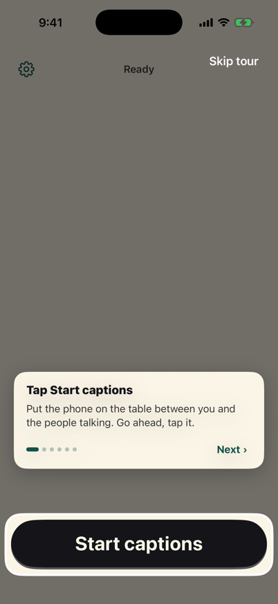 | Dim + bordered card, Next | **Yes**, PR #114 | `tour` |
| 30 | 2 Say something | 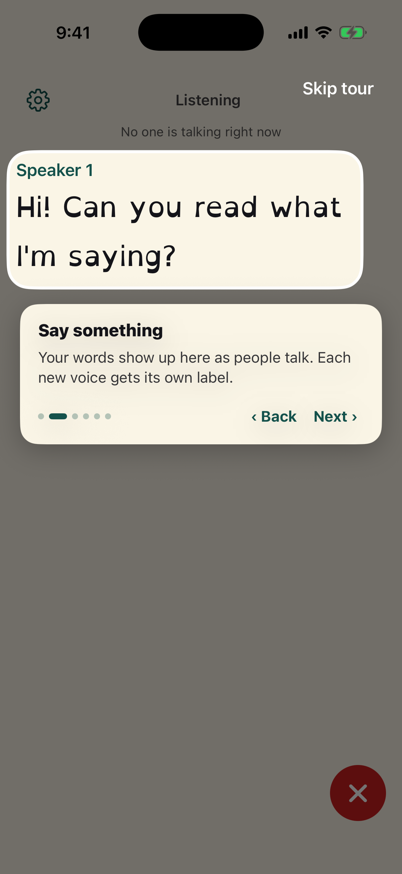 | Card | **Yes** | `tour` |
| 31 | 3 Tap X to pause | 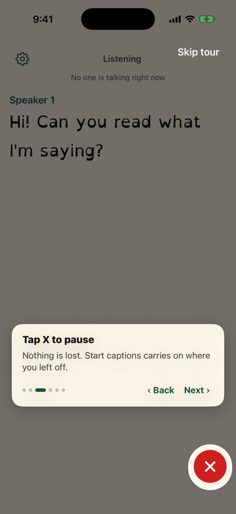 | Card | **Yes** | `tour` |
| 32 | 4 Tap [ Save ] | 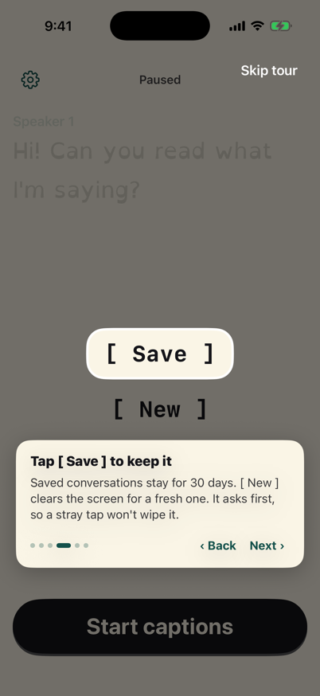 | Card | **Yes** | `tour` |
| 33 | 5 Hold on words to copy | 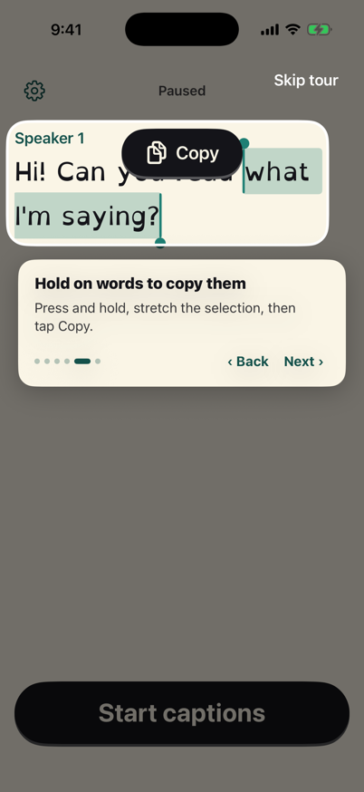 | Card | **Yes** | `tour` |
| 34 | 6 Make it yours (the gear) | 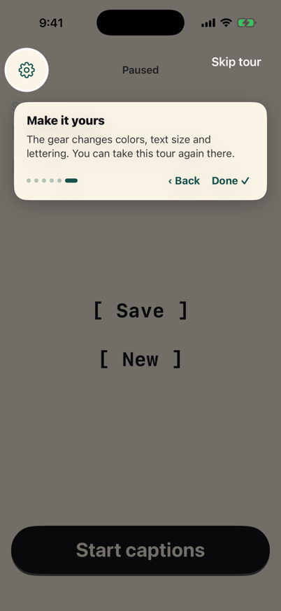 | Card | **Yes** | `tour` |

Owner: "could be more interactive … they need to do the actual interactions on the app to continue." Today every
step has Next, so it can be clicked through without doing anything.

### Settings and its screens

| # | Element | Screenshot | Appears / goes | Approved? | Decision |
|---|---|---|---|---|---|
| 35 | **Settings as a sheet** (slides up as a card, "Done") | 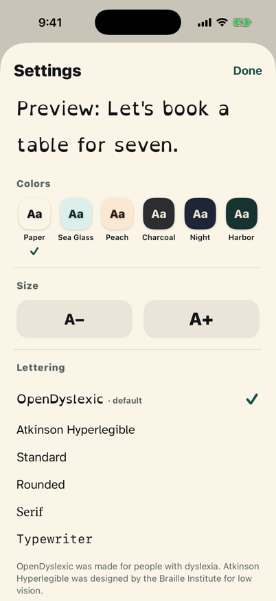 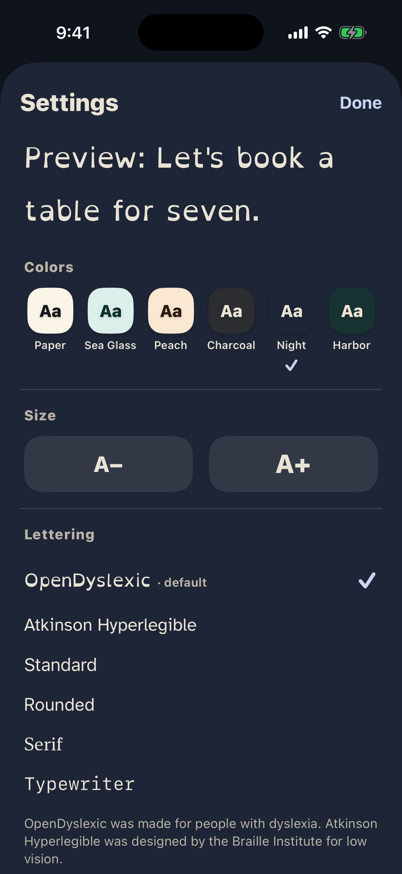 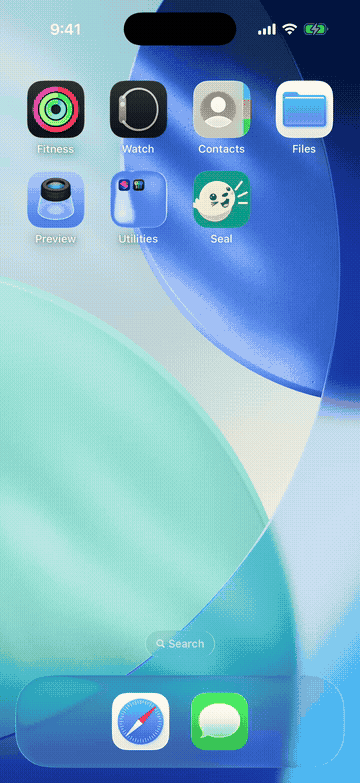 | `.sheet`, slides up/down | Contents **yes** (mock 08, PR #105); **the sheet was never approved** ("it should fade out the current screen and fade in the settings screen") | `settings` |
| 36 | **Saved conversations** (system bar, grey boxed rows, search field, ⋯ menu) | 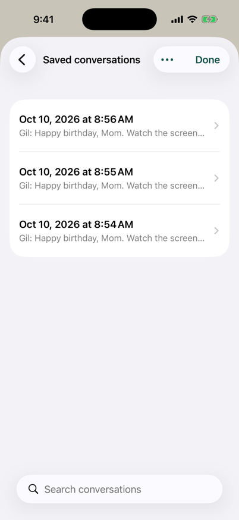 | Pushes in from the right | #52 (before v1). **Not in the v1 look** | `saved` |
| 37 | Saved conversation detail | (same system style as 36) | Pushes in from the right | #52. **Not in the v1 look** | `saved` |
| 38 | **"Delete conversation?" / "Delete all" menus** | 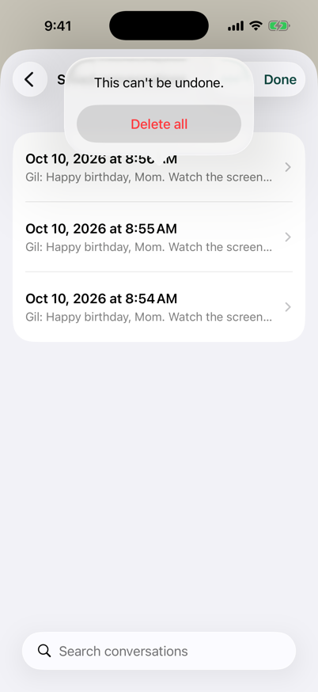 | iOS confirmation pop-up | **Not approved** (system boxes) | `deleteask` |
| 39 | **Credits** (grey boxed cards, system bar) | 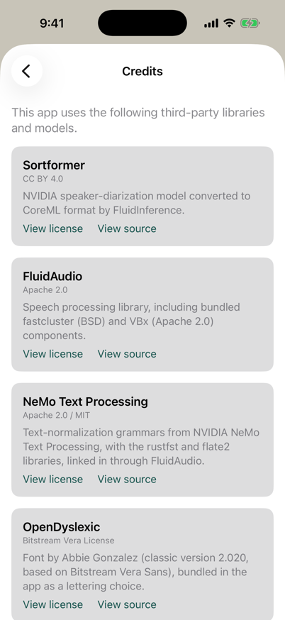 | Pushes in from the right | #21 (before v1). **Not in the v1 look** | `credits` |
| 40 | Privacy policy / Help and contact | (opens Safari) | Leaves the app | **Yes**, PR #87 | — |
| 41 | Test version section (beta only) | (PR #115 images) | In Settings | **Yes**, mock beta-feedback/03 | — |
| 42 | "What will be sent" preview (beta only) | (PR #115 images) | **A sheet** inside the Settings sheet | Contents **yes** (mock beta-feedback/04); presented as a sheet | `settings` |
| 43 | Messages / share sheet (beta only) | (PR #115 images) | iOS system sheet | **Yes** (mock beta-feedback/05); Apple's own sheet, can't be restyled | — |

## Counts

- **43 elements** audited (41 with a screenshot or recording here; 2 are system sheets Apple draws).
- **17 not approved** (or approved before v1 and not in the v1 look): 3, 5, 6, 7 (first-run look), 13, 16, 17, 18,
  22, 23, 25, 28, 35 (as a sheet), 36–37, 38, 39.
- **4 approved but boxed**, breaking the round-2 rules: 8, 9 + 29–34 (tour cards), 26, 42.

## How each state was reached (for re-running this audit)

`-ClarityDemoShow banner|preparing|confirmnew|namespeaker|canthear|failed|quiet|tour4save|savebeta`,
`-ClarityDemoSettings -ClarityDemoSettingsPush saved|credits|deleteall`, `-ClarityDemoLaunch
welcome|micdenied|unsupported|first|fail|ordinary`, plus the existing flags (`DemoMode.swift`). All DEBUG-only.
